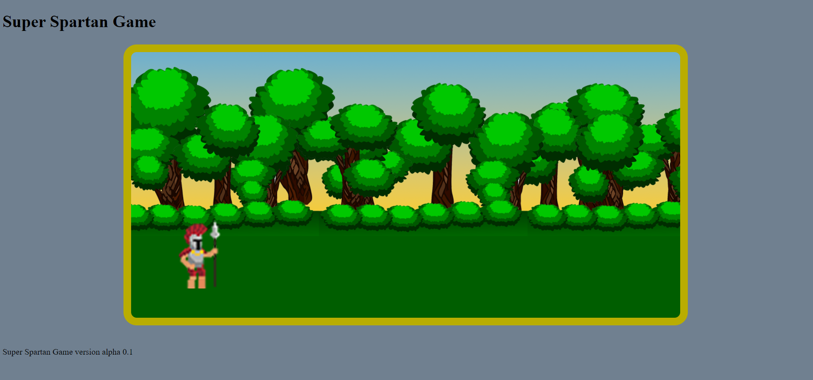

# 1. Super Spartan Game
***
This is my first JavaScript game for a **IFOCOP** project.
***
## 1.1. Table of Contents
1. [General Info](#general-info)
2. [Technologies](#technologies)
4. [Collaboration](#collaboration)
5. [FAQs](#faqs)
***
## 1.2. General Info
***
This is my *first game* made for a learning project at the **Ifocop institut (Paris XI)**.
***
I would like to make a platform game to revel my *curriculum vitae* with my new **JavaScript** skills.
***
### 1.2.1. Project status
***
Not finished yet,
***
Trying to prevent my character to go out of the game field.
***
### 1.2.2. Screenshot

***
## Technologies
***
A list of technologies used within the project:
* HTML5;
* CSS3
* JavaScript
* jQuery
***
## Collaboration
***
I don't mind if anyone want to use my work:
***
> Feel free to make a copy,
***
> Make your own version of it if it's helps you.
***
## FAQs
***
###A list of frequently asked questions###
***
####Will this game work?####
***
Yes, it will work!
***
####Is it a good game?#### 
***
For a first try, I think so.